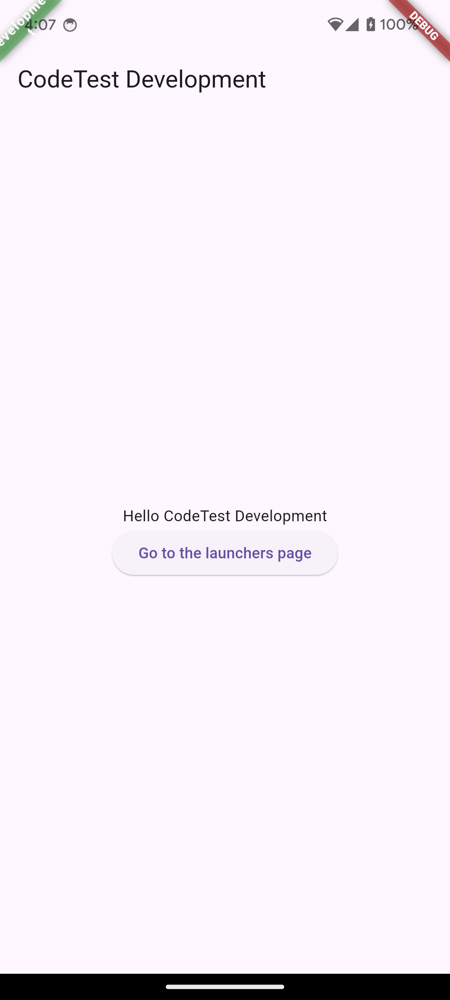
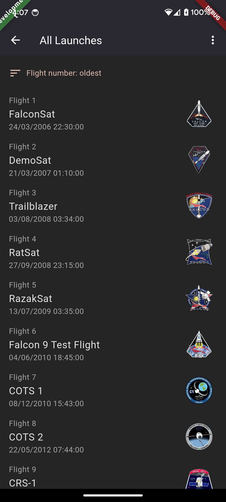

# flutter-codetest-240906
Make the flutter app from the API list and using the Riverpod and goRouter to manage.





## Basic information

Flutter stable 3.24.1

Package:
```yaml
dependencies:
  flutter:
    sdk: flutter
  cupertino_icons: ^1.0.8

  font_awesome_flutter: ^10.7.0

  equatable: ^2.0.5

  go_router: ^14.2.7

  flutter_riverpod: ^2.5.1
  riverpod_annotation: ^2.3.5

  http: ^1.2.2
  intl: ^0.19.0
  cached_network_image: ^3.4.1

dev_dependencies:
  flutter_test:
    sdk: flutter
  flutter_lints: ^4.0.0

  riverpod_generator: ^2.4.0
  build_runner: ^2.4.8

  flutter_flavorizr: ^2.2.3
  mocktail: ^1.0.4
```

## Launch the flutter by flavor

在跑之前請進行 `flutter pub get`

執行查看App跑這個：
```
flutter run --flavor development -t lib/main_development.dart
```

## Testing with flavor

測試時跑這個部分：
```
flutter test --flavor development
```

預期結果：
```bash
codetest % flutter test --flavor development
00:02 +0: flutter-codetest-240906/codetest/test/pages/launches_page_test.dart: LaunchesPage show loading indicator
error: Exception: 測試錯誤: 案例01
00:02 +2: flutter-codetest-240906/codetest/test/pages/launches_page_test.dart: LaunchesPage show error message
error: Exception: 測試錯誤: 案例02
00:02 +4: All tests passed!
```

### For Testing

```dart
  // TODO: 1.測試加載狀態時是否顯示加載指示器。
  // TODO: 2.測試錯誤狀態時是否顯示錯誤消息。
  // TODO: 3.測試數據加載成功時是否正確顯示Launches list。
```

## Git Branch Rules
- develop: 這主要專注於開發產品線
- feature: 當需要開發新功能時必須先從 `develop` 獨立出來（這次用不到）
- master: 這主要用於發佈正式版本（推上線版本正常來說需要用PR，但這次作業只要發佈版本合併即可。
- hotfix: 正式版本發生問題可透過此版本進行修復（這次用不到）

## CHANGE LOG

### 0.1.0
- feat(test): write the launches testing.
- feat(launch): add the cache image network.
- feat(launch): add the launch api data and make the state mangagment and services and build the launch class.
- fix(home): fix the go router to push not replace it.
- feat(launches): Add the basic text and color setting. and implement the scrollbar and appbar.
- fix(readme): Update the branch rules and add the CHANGE LOG
- feat(router): implement GoRouter for navigation
- add the basic flutter setting, include the flavor and codetest.